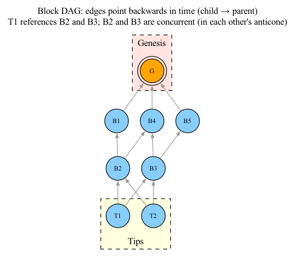
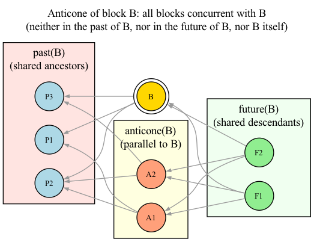

# 01 — DAG Basics

## The Problem with Linear Blockchains

In Bitcoin's blockchain, each block references exactly one previous block, forming a single chain. This works when blocks are rare (one every 10 minutes), but it severely limits throughput.

The key insight of DAG-based protocols is: **if blocks are frequent enough that multiple blocks are created simultaneously, those concurrent blocks can all be valid and included in the ledger** — they just need a conflict resolution rule to order them.

## What Is a Block DAG?

A **block DAG** (Directed Acyclic Graph) is a network of blocks where:
- Each block references **multiple** previous blocks (not just one)
- Edges point **backwards** in time (from newer to older)
- There are no cycles (a block cannot be its own ancestor)



In this DAG:
- T1 and T2 are **tips** — not referenced by any other block
- T1 references B2 and B3, meaning T1 was created after both
- T2 also references B2 and B3, so T1 and T2 are concurrent with each other
- B2 and B3 are concurrent (in each other's anticone)
- G is the **genesis** block — the first block, ancestor of all others

## Core Concepts

### Past(B)

The **past** of a block B is all blocks that are provably created **before** B. Formally, it's all blocks reachable from B by following edges backwards.

```python
def past(B, dag):
    """Returns all blocks reachable from B by following parent edges."""
    result = set()
    queue = [B]
    while queue:
        block = queue.pop()
        for parent in dag.parents(block):
            if parent not in result:
                result.add(parent)
                queue.append(parent)
    return result
```

### Future(B)

The **future** of a block B is all blocks that are provably created **after** B. Formally, it's all blocks from which B is reachable.

```python
def future(B, dag):
    """Returns all blocks that have B in their past (B is an ancestor)."""
    result = set()
    for block in dag.all_blocks():
        if B in past(block, dag):
            result.add(block)
    return result
```

### Anticone(B)

The **anticone** of a block B is all blocks whose time-relation with B is **ambiguous**. A block C is in the anticone of B if C is neither in the past of B nor in the future of B.

The key insight: anticone blocks are **parallel** to B. They have no causal connection to B — they are neither in B's past nor in B's future. This is what makes their ordering ambiguous: topologically, either could have been created first.



The diagram is laid out left-to-right: **past** on the left, **B and its anticone** in the middle, **future** on the right. Notice:
- B sits above its anticone cluster, which contains A1 and A2
- B has **no connection** to A1 or A2 (and vice versa) — they are concurrent

```python
def anticone(B, dag):
    """Returns all blocks concurrent with B (neither in past nor future)."""
    result = set()
    for block in dag.all_blocks():
        if block == B:
            continue
        if block not in past(B, dag) and B not in past(block, dag):
            result.add(block)
    return result
```

### Why Anticone Matters

The anticone represents **conflict**. If two blocks contain conflicting transactions, and they are in each other's anticone, the consensus protocol must decide which one comes first. The size of an anticone measures the "width" of concurrency at a given point.

### Tips

**Tips** are blocks that are not referenced by any other block. They represent the "frontier" of the DAG — the most recent blocks that haven't yet been built upon.

```python
def tips(dag):
    """Returns blocks that no other block references."""
    referenced = set()
    for block in dag.all_blocks():
        for parent in dag.parents(block):
            referenced.add(parent)
    return [b for b in dag.all_blocks() if b not in referenced]
```

### Genesis

The **genesis** block is the known initial block of the DAG. All blocks are reachable from the genesis block (directly or indirectly).

### Virtual Block

A **virtual block** is a hypothetical (un-mined) block that references all current tips. It represents the template for the next block an honest miner would create.

```python
def virtual_block(dag):
    """Returns the set of tips that a virtual block would reference."""
    return tips(dag)
```

The virtual block is crucial because it allows us to reason about "what would the next block see?" without actually waiting for it to be mined.

## Summary

| Concept | Symbol | Meaning |
|---------|--------|---------|
| Past(B) | `past(B)` | Blocks provably before B |
| Future(B) | `future(B)` | Blocks provably after B |
| Anticone(B) | `anticone(B)` | Blocks concurrent with B (not in past, future, or B itself) |
| Tips | `tips(G)` | Blocks not referenced by others |
| Genesis | `genesis(G)` | Initial block |
| Virtual | `virtual(G)` | Hypothetical block pointing to all tips |

The entire DAGKnight protocol is built on these topological relationships. Understanding past, future, and anticone is essential for everything that follows.
