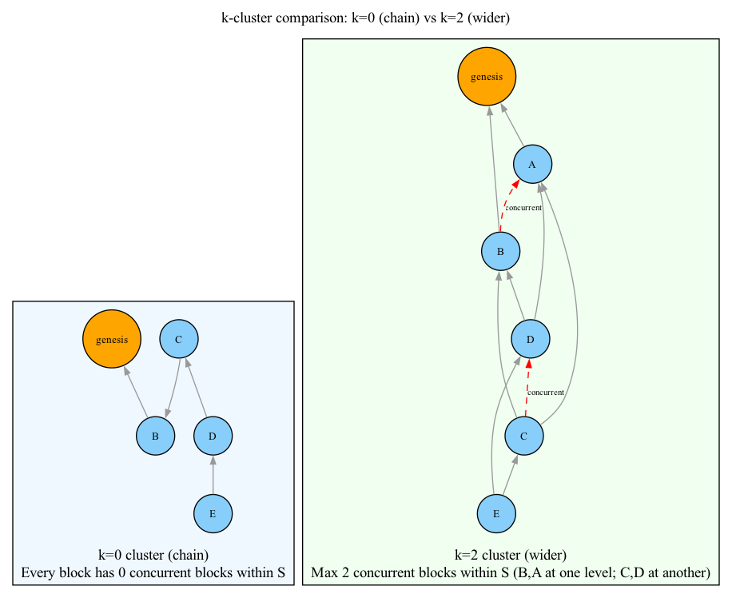
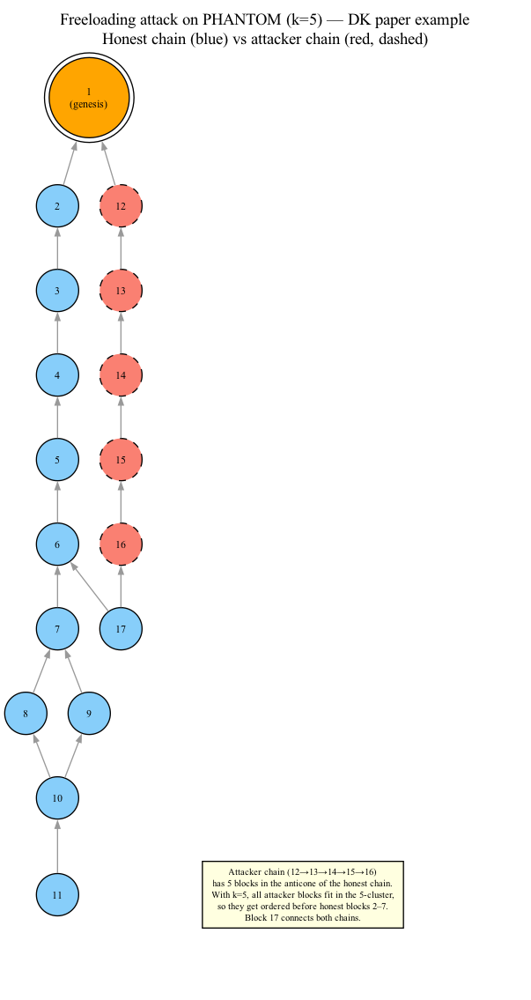

# 02 — k-Clusters

## The Core Abstraction

A **k-cluster** is the fundamental building block of DAG-based consensus. It's a subset of blocks where every block has at most `k` concurrent blocks within the subset.

### Formal Definition

Given a DAG G and a subset S of blocks in G, S is a **k-cluster** if:

```
For every block B in S:
    |anticone(B) ∩ S| ≤ k
```

In other words: within the subset S, no block has more than k other blocks that are concurrent with it.

### Intuition: What Does k Represent?

Think of `k` as a measure of **network latency**:

- **k = 0**: All blocks in the cluster form a chain. No two blocks are concurrent. This corresponds to very low latency (like Bitcoin).
- **k = 5**: Each block can have up to 5 concurrent blocks within the cluster. This corresponds to moderate latency (multiple blocks per round-trip time).
- **k = 18**: Each block can have up to 18 concurrent blocks. This corresponds to high latency (many blocks per round-trip time).

### Visual Example



- **Left (k=0)**: Each block has 0 concurrent blocks within the chain
- **Right (k=2)**: Max 2 concurrent blocks within cluster

## The PHANTOM Protocol

PHANTOM was a DAG-based consensus protocol that used a **fixed** k parameter. The protocol:

1. Takes a DAG G and a parameter k as input
2. Finds the **largest** k-cluster in G
3. Orders the DAG by giving precedence to the largest k-cluster

### The PHANTOM Optimization Problem

```
Input:  DAG G, parameter k
Output: Largest subset S of G such that S is a k-cluster
```

This is called the **Maximum k-cluster subDAG (MCS_k)** problem.

### Why PHANTOM Works (Intuitively)

Honest nodes have >50% of the hashrate. Honest blocks reference all current tips and are broadcast immediately. This means honest blocks naturally reference each other within D seconds of each other.

The largest k-cluster (where k ≈ D × λ, with D being network delay and λ being block rate) will contain the majority of honest blocks, because honest blocks form a well-connected subgraph.

### The Freeloading Attack on PHANTOM

Consider a network with very low latency (blocks form an almost-linear chain). PHANTOM is parameterized with k = 5 for safety.

The attacker creates a separate chain of 5 blocks (12→13→14→15→16) starting from genesis, concurrent with the honest chain (2→3→4→5→6→7). Block 17 connects both chains.



Because k = 5, the attacker's chain has at most 5 concurrent blocks within the honest chain. PHANTOM includes all attacker blocks in the largest 5-cluster, ordering them before honest blocks 2–7. The attacker rides along with the honest chain's proof-of-work without contributing meaningful work.

This is called **freeloading** — the attacker exploits the fixed k parameter to inject blocks into the cluster.

## Why Parameterization Is a Problem

PHANTOM requires knowing k in advance. This creates two problems:

### Problem 1: Slow Confirmation When Network Is Fast

If the actual network latency is very low (blocks form a chain), but k is set to 18 for safety:
- The protocol still operates as if there are 18 concurrent blocks
- Confirmation times are proportional to the worst-case assumption, not the actual conditions
- This is like driving at 30 mph on an empty highway because the speed limit says 30

### Problem 2: Failure When Network Is Slow

If network latency exceeds the assumption (e.g., actual k > 18 when parameter is set to 18):
- The honest blocks no longer form a valid k-cluster
- The protocol may not converge safely
- This is like the speed limit being too high for road conditions

### Problem 3: Freeloading Vulnerability

As shown above, an attacker can exploit the gap between actual latency and the parameterized k to inject blocks.

## The DAGKnight Insight

DAGKnight removes the fixed k parameter entirely. Instead of:

```
PHANTOM: Given k, find the largest k-cluster
```

DAGKnight asks:

```
KNIGHT: Find the MINIMUM k such that the largest k-cluster covers at least 50% of the DAG
```

This is a **dual optimization**:
- **Minimize k** — to exclude attacker blocks (smaller k means fewer blocks can freeload)
- **Maximize k-cluster size** — to ensure enough honest blocks are included (need >50% coverage)

The minimum k that satisfies the majority condition is called the **rank** of the DAG (more on this in Chapter 06).

## Summary

| Concept | Definition |
|---------|------------|
| **k-cluster** | A subset S where every block has at most k concurrent blocks within S |
| **MCS_k** | The largest k-cluster in a DAG (used by PHANTOM) |
| **PHANTOM** | Orders DAG by the largest k-cluster for a fixed parameter k |
| **Freeloading** | Attacker exploits fixed k to inject blocks with artificial gap |
| **DAGKnight optimization** | Find minimum k such that largest k-cluster covers ≥50% of DAG |

The k-cluster concept is the foundation. DAGKnight's innovation is not in defining k-clusters differently, but in **searching** for the right k instead of **assuming** it.
