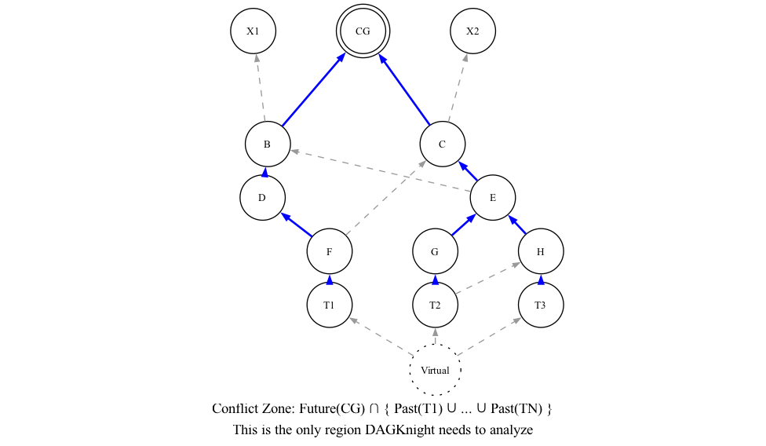
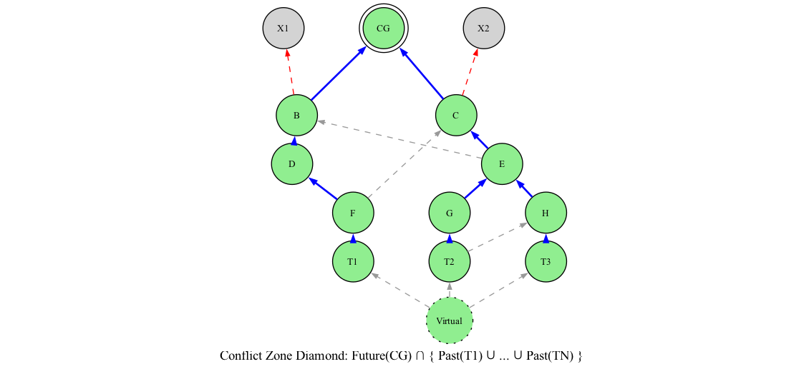
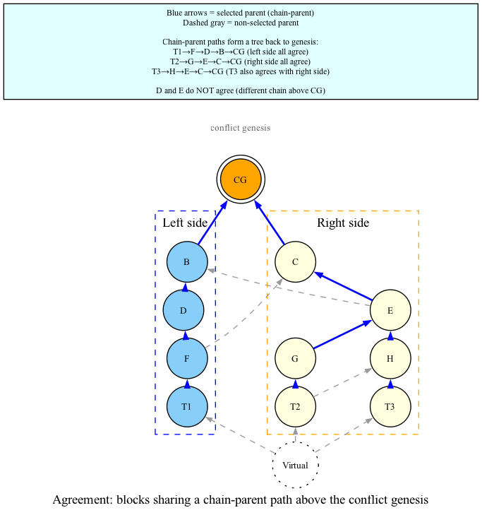

# 03 — Conflict Zones

## The Chain-Parent

In a DAG, blocks have multiple parents. Similar to GhostDAG, DAGKnight uses the concept of a **chain-parent** (also known as the **selected parent**) — a single designated parent per block that forms a "main chain" through the DAG from the POV of this block.

### Definition

For any block B, `chain-parent(B)` is a unique parent of B selected by DAGKnight's chain-selection rule. The **chain** of B is defined recursively:

```
chain(B) = (chain-parent(B), chain-parent(chain-parent(B)), ..., genesis)
```

This forms a path from B back to genesis, selecting one parent at each step.

### How Chain-Parent Is Selected

The chain-parent of B is the block that **minimizes B's rank**. If B has two parents P1 and P2, and:
- rank(B via P1) = 3
- rank(B via P2) = 5

Then P1 is B's chain-parent. (Rank will be explained in detail in Chapter 06.)

### Why a Main Chain?

The main chain serves two purposes:

1. **Ordering**: It provides a canonical ordering through the DAG. Blocks are ordered by their chain-parent selection, creating a deterministic linear order.

2. **Stability**: When network conditions change, only recent chain-parent selections may change. Past selections remain stable, preventing retroactive reordering.

## Conflict Zone

The **conflict zone** is the region of the DAG between the conflict genesis and the current tips, bounded by:

```
conflict_zone = Future(CG) ∩ { Past(T1) ∪ Past(T2) ∪ ... ∪ Past(TN) }
```

The conflict zone is where DAGKnight performs its analysis (k-colouring, UMC voting, etc.). Everything below the conflict genesis is already resolved; everything above the tips hasn't happened yet.

### Conflict Genesis

A **conflict genesis** is the point where competing chains diverge. Formally, it's the **latest common chain ancestor** of two or more competing tip groups.



Here, C is the conflict genesis because it's the latest block that is a chain ancestor of both F and G. The conflict zone is the region from C up to the tips.

### The Diamond Shape

The conflict zone forms a **diamond** shape in the DAG. It's the set of blocks that are both in the future of the conflict genesis AND in the past of all current tips.



Some blocks may have parents or children that are outside this diamond from the POV of the entire DAG. But for the purposes of coloring and voting, those outside blocks are **ignored** entirely — only blocks inside the diamond participate in k-colouring and UMC voting.

- **Inside the diamond**: Colored (blue/red/gray) and participate in UMC voting
- **Outside the diamond**: Ignored for this conflict zone's analysis

## Agreement

### Definition

A set of blocks X **agrees** in a DAG G relative to a conflict genesis g if their latest common chain ancestor is a chain-descendant of g:

```
There exists some block g' such that:
  - g is in the chain of g' (g is an ancestor of g')
  - g' is in the chain of every block in X
```

### Intuition

Two blocks "agree" when they share a common chain-extension above the conflict point. They are on the same "side" of a conflict.



Three tips compete: **T1** (left side, blue) and **T2, T3** (right side, yellow/orange).

Agreement chains (blue arrows = selected parent):
- **Left side**: T1 → F → D → B → CG — all agree
- **Right side**: T2 → G → E → C → CG and T3 → H → E → C → CG — all agree

- T1 and T2 do **not** agree (different chain above CG: B vs C)
- T2 and T3 **do** agree (same chain above CG through E → C → CG)
- D and E do **not** agree (different chain above CG)

Dashed gray edges show non-selected parents (e.g., F also references C, but did not select it).

### Why Agreement Matters

Agreement allows DAGKnight to group competing tips into **subgroups** of internally-consistent candidates. Each subgroup represents a "side" in a conflict, and DAGKnight evaluates each subgroup independently.

## Gray Blocks

During k-colouring within a conflict zone, blocks are classified as:

- **Blue**: Part of the selected k-cluster
- **Red**: Not part of the k-cluster
- **Gray**: A red block that **agrees** with the winning subgroup

### Why Gray Blocks Exist

Consider a red block R (not in the k-cluster) that shares a chain ancestor with the winning subgroup. This block is:
- **Red** from the k-colouring perspective (it was excluded from the cluster)
- But **aligned** with the winning subgroup (it's on their side of the conflict)


Gray blocks (G1, G2) are red (not in the cluster) but agree with the winning subgroup — they are neutralized in UMC voting.

### How Gray Blocks Are Identified

A red block is **gray** if:

```
next_chain_ancestor(red_block, conflict_genesis) ==
next_chain_ancestor(winning_subgroup, conflict_genesis)
```

In other words, the red block's next chain ancestor (going backward from the red block toward the conflict genesis) matches that of the winning subgroup.

### Why Gray Blocks Matter

Gray blocks are counted as **neutral** in UMC voting. They are red (not in the k-cluster) but they agree with the winning side, so they shouldn't count against the winning cluster. This distinction is essential for fair evaluation:

- **Blue work**: Supports the cluster
- **Red work**: Opposes the cluster
- **Gray work**: Neutral (neither supports nor opposes)

## The Virtual Block and Virtual Selected Parent

### Virtual Block

Recall from Chapter 01: the virtual block is a hypothetical block pointing to all current tips. In the context of a conflict zone, the virtual block's parents are all the tips of the DAG.

### Virtual Selected Parent (VSP)

When evaluating a subgroup's rank, DAGKnight needs to determine what the virtual block's selected parent would be. The VSP is the **tip within the subgroup with the highest blue work**:

```python
def virtual_selected_parent(subgroup_tips, blue_work_map):
    """The VSP is the tip with maximum blue work within the subgroup."""
    return max(subgroup_tips, key=lambda t: blue_work_map[t])
```

The VSP represents "what the next honest block would select as its chain-parent if it agreed with this subgroup."

## Summary

| Concept | Definition | Role |
|---------|------------|------|
| **Chain-parent** | Unique parent per block forming a main chain | Provides canonical ordering |
| **Agreement** | Blocks sharing a chain extension above conflict point | Groups blocks into subgroups |
| **Conflict genesis** | Latest common chain ancestor of competing tips | Boundary of conflict zone |
| **Conflict zone** | `Future(CG) ∩ { Past(T1) ∪ ... ∪ Past(TN) }` | Region analyzed by DAGKnight |
| **Blue block** | Part of the k-cluster | Supports cluster |
| **Red block** | Not in the k-cluster | Opposes cluster |
| **Gray block** | Red but agrees with winning subgroup | Neutral in voting |
| **VSP** | Highest blue-work tip in subgroup | Represents next block's selection |
