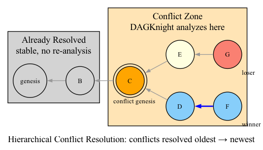

# 04 — Hierarchical Conflict Resolution

## The Main Algorithm

DAGKnight's main ordering algorithm (Algorithm 2 in the paper) is called **Order-DAG**. It takes a DAG as input and returns:

1. The selected tip (which becomes the chain-parent)
2. A deterministic ordering of all blocks in the DAG

### The Big Picture

```
Input:  DAG G
Output: (selected_tip, ordering_of_G)

function Order-DAG(G):
    # BASE CASE: Genesis block
    if G contains only genesis:
        return (genesis, [genesis])

    # RECURSIVE STEP: Order each tip's past
    for each tip B in G:
        (chain_parent_B, ordering_B) = Order-DAG(past(B))

    # CONFLICT RESOLUTION: Select among competing tips
    candidates = all tips of G

    while |candidates| > 1:
        # Find the conflict point
        conflict_genesis = latest common chain ancestor of all candidates

        # Split into agreement subgroups
        subgroups = partition candidates by their next chain ancestor above conflict_genesis

        # Evaluate each subgroup's rank
        for each subgroup:
            subgroup.rank = Calculate-Rank(subgroup, future(conflict_genesis))

        # Find the minimum rank
        best_rank = min(subgroup.rank for all subgroups)

        # Eliminate subgroups with higher rank
        tied = subgroups where subgroup.rank == best_rank

        # Break ties if needed
        if |tied| > 1:
            winners = Tie-Breaking(future(conflict_genesis), tied)
        else:
            winners = tied[0]

        # Eliminate losers from candidates
        for each subgroup not in winners:
            candidates -= subgroup.blocks

        candidates = blocks from winning subgroup

    # SELECTED TIP: The sole survivor
    selected_tip = the single remaining candidate

    # BUILD ORDERING: Chain order + anticone blocks
    return (selected_tip, ordering_of_selected_tip + [selected_tip] + anticone_of_selected_tip)
```

## Step by Step Breakdown

### Step 1: Recursive Ordering

For each tip B, recursively call Order-DAG on B's past. This establishes each tip's:
- Chain-parent (which parent it selected from its past)
- Ordering (deterministic block order within its past)

This recursion bottoms out at genesis, which has no parents and returns immediately.

### Step 2: Find the Conflict

The **latest common chain ancestor (LCCA)** of all candidates is the conflict genesis. This is the most recent block where all candidates still "agreed."



### Step 3: Partition into Subgroups

Split candidates into **agreement subgroups** based on their next chain ancestor above the conflict genesis:

```python
def next_chain_ancestor(block, conflict_genesis):
    """Walk the chain from block toward conflict_genesis, return the block just above CG."""
    current = block
    while current != conflict_genesis:
        parent = chain_parent(current)
        if chain_parent(parent) == conflict_genesis:
            return parent
        current = parent
```

Blocks with the same next chain ancestor form a subgroup. Each subgroup represents a "side" in the conflict.

### Step 4: Rank Each Subgroup

For each subgroup, calculate its rank using the algorithm from Chapter 06:

```
rank_i = Calculate-Rank(subgroup_i, future(conflict_genesis))
```

### Step 5: Eliminate Losers

Subgroups with higher rank are eliminated. Only the subgroup(s) with the minimum rank survive.

### Step 6: Tie-Breaking (if needed)

If multiple subgroups share the minimum rank, the tie-breaking algorithm (Chapter 07) selects the winner.

### Step 7: Iterate

If there are still multiple candidates within the winning subgroup, go back to Step 2 and find the next conflict. This is the **hierarchical** aspect — conflicts are resolved from oldest to newest.

## Why Hierarchical?

The while loop creates a **conflict hierarchy** — conflicts are resolved from oldest to newest, with each level narrowing the candidate set.

This hierarchical approach has two benefits:

1. **Early-to-recent ordering**: Oldest conflicts are resolved first, providing stability for settled parts of the DAG.

2. **Adaptiveness**: Each level of conflict can have a different rank. If the network was slow in the past (high rank) but is fast now (low rank), the hierarchy naturally adapts.

## The Return Value

### Selected Tip

The final survivor of the while loop. This block becomes the **chain-parent** of the next block to be mined.

### Ordering

The ordering is built by concatenation:

```
ordering = order_of_selected_tip + [selected_tip] + anticone_blocks
```

Where:
- `order_of_selected_tip` is the recursive ordering from the selected tip's past
- `[selected_tip]` is the selected tip itself
- `anticone_blocks` are blocks in the selected tip's anticone, ordered by hash-based topological sort

This ensures that:
1. Blocks in the selected tip's past come first
2. The selected tip comes next
3. Anticone blocks come last, in a deterministic order

## Decoupling Ordering from Colouring

### The Problem

If we directly used the k-cluster for ordering, a sudden increase in network latency would change the k value retroactively, causing all past orderings to change. This is called **ordering instability**.

### DAGKnight's Solution

DAGKnight **decouples** cluster-selection from chain-ordering:

- **Cluster-selection** (k-colouring) determines which blocks are blue/red
- **Chain-ordering** (chain-parent selection) determines the canonical order
- A block's chain-parent is the block that **minimizes its rank**

This means:
- Different parts of the chain can have different k values
- Past parts of the chain keep their k value (stable)
- Only recent parts adapt to new conditions

### Example

```
Chain: A → B → C → D → E → F
         k=2    k=2    k=5    k=5    k=3

At C, an attack was detected (k went from 2 to 5).
At E, the attack ended (k dropped to 3).
Blocks A and B keep k=2 (stable ordering).
Blocks C and D have k=5 (attack period).
Block F has k=3 (recovery period).
```

## Gray Blocks in the Hierarchy

During the rank calculation for each subgroup, gray blocks are identified:

```
gray_block = red_block whose next_chain_ancestor matches the winning subgroup's
```

Gray blocks:
- Are counted as **neutral** in UMC voting
- Don't contribute to the winning or losing side
- Help prevent unfair disadvantage to subgroups with red blocks that happen to agree with them

## Complexity

| Aspect | Complexity |
|--------|------------|
| While loop iterations | O(|tips|) — at least one subgroup eliminated per iteration |
| Rank calculation per subgroup | O(K_search × zone_size × K) |
| Total (with rank search) | O(|tips| × log(max_k) × zone_size × K) |
| Overall recursion | Polynomial in |G| |

## Summary

| Concept | Definition |
|---------|------------|
| **Order-DAG** | Main algorithm: recursively orders DAG and resolves conflicts |
| **LCCA** | Latest common chain ancestor — the conflict point |
| **Agreement subgroups** | Tips partitioned by shared chain extension above conflict |
| **Hierarchy** | Conflicts resolved from oldest to newest |
| **Decoupling** | Cluster-selection separate from chain-ordering for stability |
| **Selected tip** | Final survivor, becomes chain-parent |

The hierarchical conflict resolution algorithm is the orchestrator of DAGKnight. It uses all the components we've studied (k-colouring, UMC voting, rank, tie-breaking) to produce a deterministic, stable, and adaptive ordering of the entire DAG.
