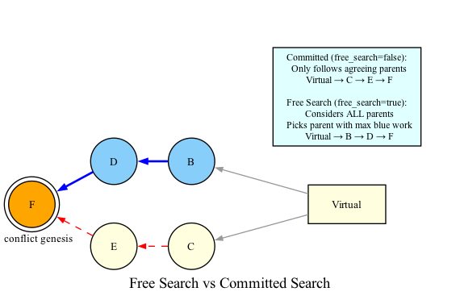

# 05 — K-Colouring

## The Problem

We need to find a k-cluster (a subset where every block has at most k concurrent blocks within the subset). Finding the **maximum** k-cluster exactly is NP-hard.

DAGKnight uses a **greedy** approach, similar to GHOSTDAG, that builds the k-cluster incrementally from genesis to tips. This is called **k-colouring**.

## The Algorithm

### High-Level Idea

Process blocks in topological order (from past to future). For each block, decide whether to colour it **blue** (include in the cluster) or **red** (exclude from the cluster). The decision is based on whether adding the block would violate the k-cluster property.

### K-Colouring Algorithm (Pseudocode)

```
Input:  C — the current block being coloured
        G — the DAG
        k — the maximum allowed anticone width
        free_search — if true, explore all parents; if false, only agreeing parents

Output: (blues, chain) — the blue cluster and the chain backbone

function K-Colouring(C, G, k, free_search):
    if C has no parents in G:
        return (empty set, empty chain)

    candidates = []

    for each parent B of C:
        if B agrees with C:
            # Always recurse into agreeing parents
            (blues_B, chain_B) = K-Colouring(B, past(B) ∩ G, k, free_search)
            candidates.append(B)

        else if free_search OR k > rank(C):
            # Free search: explore all parents
            # Committed with high k: also explore non-agreeing parents
            (blues_B, chain_B) = K-Colouring(B, past(B) ∩ G, k, true)
            candidates.append(B)

    # Select the parent with the most blues (break ties by hash)
    B_max = argmax over candidates of |blues_B|

    blues = blues_{B_max} ∪ {B_max}
    chain = chain_{B_max} ∪ {B_max}

    # Now try to add blocks in B_max's anticone to the cluster
    for each block B in anticone(B_max) in topological order:
        if |chain ∩ anticone(B)| ≤ k AND |blues ∩ anticone(B_max)| < k:
            blues = blues ∪ {B}  # Colour B blue

    return (blues, chain)
```

### Step by Step

**Step 1: Recurse into parents**

For each parent of the current block, recursively compute its k-colouring. The recursion follows the chain-parent path backwards to genesis.

**Step 2: Select the best parent**

Choose the parent whose k-colouring produced the **largest** blue set. This parent becomes part of the chain.

**Step 3: Extend the cluster (the "mergeset" step)**

After selecting the chain parent (B_max), look at blocks in B_max's anticone. These are blocks that were not on the chain path but could still be included in the cluster. A block is added if:

1. It has at most k chain blocks in its anticone (preserves k-cluster property for chain blocks)
2. B_max has fewer than k blues in its anticone (preserves k-cluster property for B_max)

These added blocks form the **mergeset**.

## Free Search vs Committed Search

### Free Search (`free_search = true`)

- Explores **all** parents of each block
- Selects the parent with maximum blue work, regardless of whether it agrees
- Used for: reference clusters in tie-breaking, initial exploration

**Use case**: When you want an unbiased view of the largest possible k-cluster, without committing to any side of a conflict.

### Committed Search (`free_search = false`)

- Only explores parents that **agree** with the current block
- Commits the search to blocks on the same side of a conflict
- Used for: rank calculation, subgroup evaluation

**Use case**: When evaluating a specific subgroup's rank, you want to stay on "their side" of the conflict.

### Example



**Committed** (free_search=false): Only follows agreeing parents. If evaluating subgroup {C}, the chain follows F → E → C → Virtual. Blocks B and D are not explored.

**Free Search** (free_search=true): Virtual considers both B and C. If B has more blue work than C, it selects B. The chain might follow F → D → B → Virtual. All blocks are explored.

## The Chain Backbone

The **chain** returned by k-colouring is a sequence of blocks:

```
chain = [genesis, ..., B_n-1, B_n]
```

Each B_i in the chain:
- Was selected as the best parent (max blues) of some block
- Its mergeset contains all blue blocks coloured at that step

The chain serves as the "spine" of the k-cluster. Every blue block is either on the chain or in some chain block's mergeset.

### Mergeset

For a chain block B:

```
mergeset(B) = past(B) \ past(chain-parent(B))
```

The mergeset is the set of blocks that B brings "new" to the cluster — blocks that weren't already included through the chain-parent.

## Key Properties

1. **Greedy**: The algorithm makes locally optimal choices at each step. It doesn't explore all possible k-clusters.

2. **Deterministic**: Given the same DAG, k, and free_search mode, the algorithm always produces the same result.

3. **k-cluster guarantee**: The returned blue set is guaranteed to be a K(k)-cluster (with K(k) = (2k+1)(k+1), which is a larger bound that accounts for the greedy approximation).

4. **Past-to-future**: Blocks are coloured in topological order, ensuring that when a block is coloured, all its past is already coloured.

## Complexity

| Aspect | Complexity |
|--------|------------|
| Per block | O(K) for mergeset processing |
| Total | O(|zone| × K) |
| Memory | O(|zone|) for storing colouring data |

Where K is the k parameter (bounds the anticone width).

## Summary

| Concept | Definition |
|---------|------------|
| **K-Colouring** | Greedy algorithm to build a k-cluster from past to future |
| **Blue** | Block included in the cluster |
| **Red** | Block excluded from the cluster |
| **Chain** | Backbone of selected parents through the cluster |
| **Mergeset** | Blocks added at each chain step (not on the chain path) |
| **Free Search** | Explores all parents (unbiased) |
| **Committed** | Only explores agreeing parents (biased to one side) |

K-Colouring is the workhorse of DAGKnight. It's called repeatedly during rank calculation (with increasing k) and during tie-breaking (with different k values). Understanding its two modes (free vs committed) is essential for the algorithms that follow.
