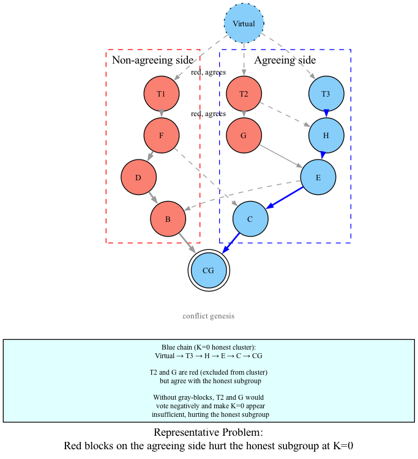
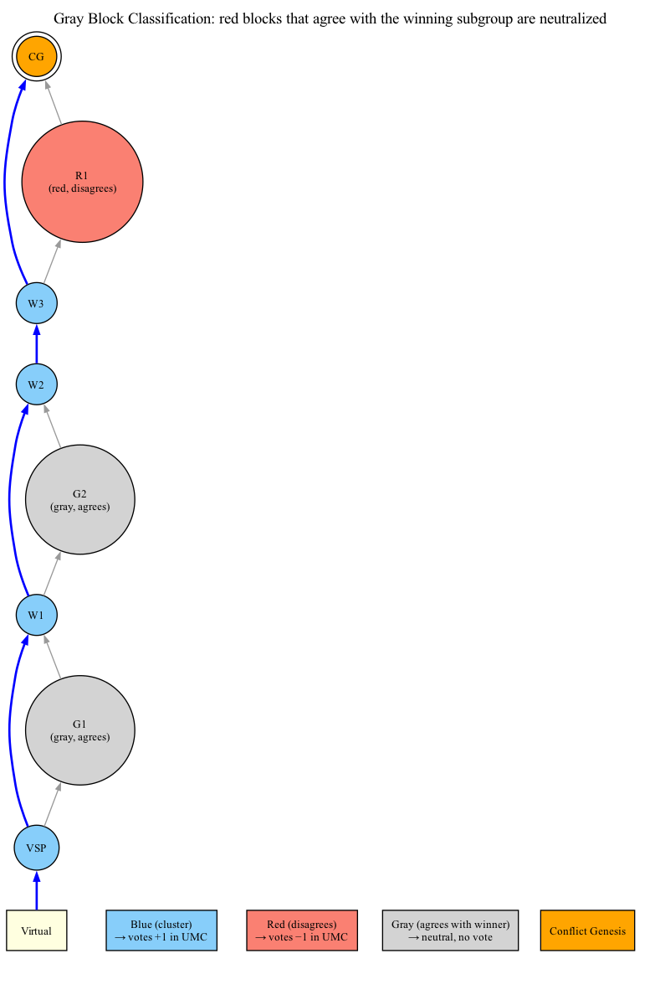

# 06 — Rank

## What Is Rank?

The **rank** of a subgroup is the **minimum k** for which the k-cluster returned by k-colouring passes the UMC voting check.

### Intuition

Rank measures how "wide" the network's concurrency is from the perspective of a given subgroup:

- **Low rank (k = 0)**: The network is very connected (like a chain). Fast confirmation.
- **High rank (k = 20)**: The network has high concurrency. Slower confirmation.
- **Rank increases when**: Latency increases, attacker creates artificial splits, or network conditions deteriorate.

## The Rank Search Algorithm

### Naive Linear Search

```python
def calculate_rank(subgroup, dag, all_tips):
    """Find minimum k where UMC voting passes."""
    for k in range(0, max_k):
        blues = k_colouring(vsp_of(subgroup), dag, k, free_search=False)
        if umc_voting(conflict_zone, blues, reds, grays, deficit=floor(sqrt(k))) > 0:
            return k
    return None  # No valid k found
```

### Exponential + Binary Search

Linear search is slow. DAGKnight uses a two-phase approach:

**Phase 1 — Exponential Probing:**

```python
# Start at k=0, double each step
k = 0
while k < max_k:
    result = evaluate(k)
    if result is not None:
        # Found a valid k, remember it
        upper_bound = k
        break
    lower_bound = k + 1
    k = k * 2 + 1  # Exponential growth
```

**Phase 2 — Binary Search:**

```python
# Binary search between lower_bound and upper_bound
while lower_bound < upper_bound:
    mid = (lower_bound + upper_bound) // 2
    result = evaluate(mid)
    if result is not None:
        upper_bound = mid  # mid works, try smaller
    else:
        lower_bound = mid + 1  # mid too small

return lower_bound  # Minimum valid k
```

This reduces the number of k-colouring + UMC voting calls from O(max_k) to O(log(max_k)).

## From Representatives to Gray Blocks

### The Problem

Consider a scenario where an attacker mines blocks that:

1. Reference the honest subgroup (making them "agree" with it)
2. Are not included in the honest subgroup's k-cluster (they are red)

These red blocks agree with the honest subgroup but are not part of its cluster. If they cast negative votes in UMC voting, they unfairly hurt the honest subgroup's chances of passing. The honest subgroup's rank would be artificially inflated.



Here, T1 and T2 are attacker blocks. They are **red** (not in the honest cluster) but they **agree** with the honest subgroup (they share a chain extension above CG). If T1 and T2 are treated as normal red blocks in UMC voting, they cast negative votes and hurt the honest subgroup's score.

### The Paper's Solution: Representatives

The paper's Algorithm 3 solves this problem using **representatives**:

```
For a subgroup P, a representative is:
    r ∈ past(P) \ past(other_tips)
    AND r agrees with P
```

Rank is evaluated by running k-colouring from **each representative's** perspective:

```python
def calculate_rank_with_representatives(subgroup, dag, other_tips):
    """Paper's approach: run k-colouring for each representative."""
    reps = find_representatives(subgroup, dag, other_tips)
    for k in range(0, max_k):
        for r in reps:
            blues = k_colouring(r, dag, k, free_search=False)
            if umc_voting(dag_minus_future(r), blues, deficit=floor(sqrt(k))) > 0:
                return k
    return None
```

**Why this works**: Representatives are blocks that are in the subgroup's past but not in other subgroups' past. Attacker blocks that reference both the honest subgroup and the attacker subgroup are excluded (they're in both pasts).

**Why this is expensive**: You must compute k-colouring for **each representative independently**. If there are N representatives, you pay N × (k-colouring + UMC-voting) per rank check.

### The Practical Solution: Gray Blocks

Instead of computing separate k-colourings for each representative, DAGKnight uses a simpler, cheaper approach: **gray blocks**.

The idea is elegant: run k-colouring **once** from the subgroup's Virtual Selected Parent (VSP). Then, in UMC voting, classify red blocks into two categories:

| Category | Definition | Vote in UMC |
|----------|------------|-------------|
| **Red** | Not in cluster, does NOT agree with subgroup | **Negative** (-1) |
| **Gray** | Not in cluster, but DOES agree with subgroup | **Neutral** (0) |

```python
def classify_red_block(red_block, winning_subgroup, conflict_genesis):
    """Determine if a red block is gray or red."""
    nca_of_red = next_chain_ancestor(red_block, conflict_genesis)
    nca_of_winning = next_chain_ancestor(winning_subgroup[0], conflict_genesis)
    return nca_of_red == nca_of_winning  # True = gray, False = red
```

Gray blocks don't cast any vote — they are effectively **ignored** in UMC voting. This is the practical replacement for the representatives mechanism:

| Aspect | Representatives (Paper) | Gray Blocks (Practice) |
|--------|-------------------------|------------------------|
| **Mechanism** | Run k-colouring from each representative's POV | Run k-colouring once; neutralize agreeing reds |
| **k-colourings per rank check** | One per representative | One (from VSP) |
| **UMC voting** | Standard (blues vs reds) | Three-way (blues vs reds, grays neutral) |
| **Cost** | O(representatives × zone) | O(zone) |
| **Effectiveness** | Same: prevents agreeing reds from hurting subgroup | Same: prevents agreeing reds from hurting subgroup |

The gray block approach achieves the same outcome — red blocks that agree with a subgroup don't harm that subgroup — at a fraction of the computational cost.



In this diagram:
- **Blue blocks** (VSP, W1, W2, W3): In the cluster, vote +1 in UMC
- **R1** (red): Not in cluster AND doesn't agree with winning subgroup → votes -1
- **G1, G2** (gray): Not in cluster but DO agree → neutral, no vote

### Summary of the Evolution

The paper uses **representatives** (Algorithm 3) to ensure monotonicity and fairness. The practical implementation uses **gray blocks** — a single k-colouring from the VSP, with agreeing reds neutralized in UMC voting. Both approaches solve the same problem; gray blocks are just cheaper.

## The g(k) Deficit Function

### Definition

```
g(k) = floor(sqrt(k))
```

### Purpose

The deficit `g(k)` allows the UMC voting to pass even if the cluster is slightly short of majority at some point. The deficit scales with sqrt(k) because:

- Larger k means wider anticones
- Wider anticones mean more blocks can be temporarily "in flight"
- The deficit accounts for these in-flight blocks

### Why sqrt(k)?

The sqrt(k) relationship balances two competing needs:

1. **Safety**: Deficit should be small enough to prevent attacker manipulation
2. **Liveness**: Deficit should be large enough to allow honest blocks to pass despite natural latency

The square root grows slowly enough to limit attacker advantage while growing fast enough to accommodate honest latency.

## Rank in Context

### Where Rank Is Used

| Context | Rank Purpose |
|---------|-------------|
| Chain-parent selection | Block chooses chain-parent that minimizes its rank |
| Hierarchical conflict resolution | Compare subgroups by rank; lower rank wins |
| Tie-breaking | When subgroups have equal rank, use Algorithm 4 |

### Rank Stability

DAGKnight is designed so that rank is **stable** for settled parts of the DAG:

- Once a block's chain-parent is determined, it doesn't change
- Rank is computed within a conflict zone (bounded by conflict genesis)
- New blocks above the conflict zone don't affect past ranks

This stability is what allows DAGKnight to achieve convergence.

### Rank Is Adaptive

The core property of rank is that it is **adaptive to the actual latency observed in the DAG**. By evaluating from the conflict genesis upward, DAGKnight judges only the recent topology that matters for the current conflict. It does not drag old history into the decision.

This means:
- If the network is fast now (low latency), rank will be low — confirming quickly
- If an attack created artificial splits (high concurrency), rank will be high — slowing confirmation as a defensive measure
- Once the attack ends, rank naturally drops — the network recovers without manual intervention

This adaptiveness is what distinguishes DAGKnight from protocols that rely on a fixed, globally-configured k parameter.

## Summary

| Concept | Definition |
|---------|------------|
| **Rank** | Minimum k for which k-cluster passes UMC voting |
| **Rank search** | Exponential probing + binary search for minimum valid k |
| **Representative** | (Paper) Block in subgroup's past but not others', used for separate k-colouring |
| **Gray block** | (Practice) Red block that agrees with subgroup → neutral in UMC voting |
| **g(k)** | Deficit function: floor(sqrt(k)) |
| **Monotonicity** | Adding blocks to winner's past doesn't cause it to lose |

Rank is the bridge between k-colouring and conflict resolution. It translates the abstract k-cluster concept into a concrete metric that can be compared across competing subgroups. The gray block mechanism (practical replacement for the paper's representatives) ensures that rank computation is robust against manipulation while being computationally efficient.
