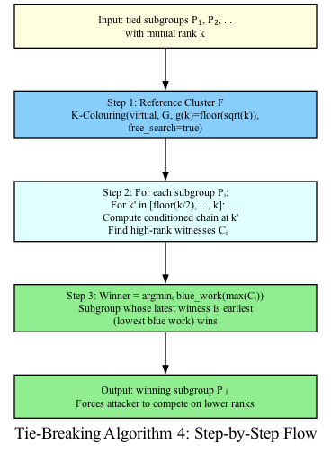
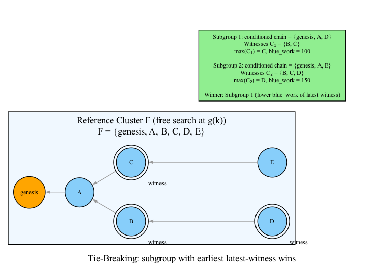

# 07 — Tie-Breaking

## When Tie-Breaking Is Needed

During hierarchical conflict resolution, if two or more subgroups have the **same minimum rank**, we need a tie-breaking mechanism to select the winner.

### Why Do Ties Happen?

1. **Symmetric attacks**: Two attacker groups with equal strength
2. **Poisson bursts**: Random simultaneous block creation creating symmetric subgraphs
3. **Recovery period**: After a temporary anomaly, both sides may have the same inflated rank

## The Recovery Problem

### The Danger

Consider a network operating at its natural rank k* = 3. A temporary anomaly (Poisson burst) causes the rank to spike to K = 20. After the anomaly passes, both competing subgroups have rank K = 20.

If we use a naive tie-breaking rule (prefer the larger k-cluster), an attacker can:

1. Keep one side perpetually tied at rank K
2. The attacker's side always has a "larger" k-cluster (because larger k includes more blocks)
3. The network never recovers to rank k*

This is called a **liveness attack** — the attacker prevents the network from recovering to normal operation.

### DAGKnight's Solution

Tie-breaking is designed to identify the subgroup whose cluster utilized the excessive rank **latest**, and prefer its counterpart. This forces the attacker to compete on lower ranks.

## Algorithm 4: Tie-Breaking

### The Algorithm (Pseudocode)

```
Input:  G — the DAG (restricted to conflict zone)
        P_1, ..., P_m — the tied subgroups
        k — the mutual rank of all subgroups

Output: The winning subgroup P_j

function Tie-Breaking(G, P_1, ..., P_m):
    # STEP 1: Compute reference cluster F
    # Uses free_search=true (unbiased view)
    g_k = floor(sqrt(k))
    (F, chain_F) = K-Colouring(virtual(G), G, g_k, free_search=true)

    # STEP 2: For each subgroup, compute high-rank witnesses
    for each subgroup P_i:
        C_i = empty set

        for k' in {floor(k/2), ..., k}:
            # Conditioned chain: what would k'-chain look like
            # if virtual block agreed with P_i?
            (_, chain_{i,k'}) = K-Colouring(virtual(G), G, k', free_search=false)
            #   conditioned on virtual(G) agreeing with P_i

            # Find F-blocks that have too many concurrent chain blocks
            for each block B in F:
                concurrent = count blocks in chain_{i,k'} that are in anticone(B)
                if concurrent > k':
                    C_i = C_i ∪ {B}

    # STEP 3: Select winner
    # max(C_i) = block in C_i with highest blue work (latest witness)
    # argmin = subgroup with earliest latest witness

    j = argmin over i of (blue_work of max(C_i))
    # Break ties by hash of selected_parent

    return P_j
```

### Step by Step

#### Step 1: Reference Cluster F

Compute a **free-search** k-colouring at `g(k) = floor(sqrt(k))`. This gives an unbiased baseline of the k-cluster, without committing to any subgroup.

```
F = free k-colouring at k = floor(sqrt(k))
```

The reference cluster F represents "what the network looks like without bias."

#### Step 2: Conditioned Chains

For each subgroup P_i, and for each k' from floor(k/2) to k:

1. Compute what the k'-chain would look like if the virtual block were forced to agree with P_i
2. This is a **committed** (free_search=false) k-colouring

The range `floor(k/2)` to `k` captures the "transition zone" where the subgroup's rank changes from natural to inflated.

#### Step 3: High-Rank Witnesses

For each F-block B, check how many blocks in the conditioned chain are concurrent with B:

```python
def count_concurrent(block_b, chain):
    """Count chain blocks concurrent with block_b."""
    count = 0
    for chain_block in chain:
        if not is_ancestor(block_b, chain_block) and \
           not is_ancestor(chain_block, block_b):
            count += 1
    return count
```

If `count_concurrent(B, chain) > k'`, then B is a **high-rank witness** — it's a block in the reference cluster that has too many concurrent blocks in the conditioned chain, indicating that the subgroup used excessive rank.

#### Step 4: Winner Selection

For each subgroup, find the witness with the **highest blue work** (the latest witness in time). The subgroup whose latest witness is **earliest** (lowest blue work) wins.

```
winner = subgroup with min(max_blue_work(C_i))
```

### Why This Works

The intuition is:

1. The side that **used** excessive rank **latest** has witnesses that extend furthest into the future (higher blue work)
2. The side that **didn't use** excessive rank (or used it earlier) has witnesses that stop earlier (lower blue work)
3. We prefer the side with **earlier** witnesses — this is the side that is "more legitimate"

In other words, we penalize the side that is **still** using excessive rank, forcing the attacker to either:
- Stop using excessive rank (recover to k*)
- Continue using excessive rank (and lose the tie-break)

### Tie-Breaking Flow



### Visual Example



Reference cluster F (free search at g(k)): {genesis, A, B, C, D, E}

| Subgroup | Conditioned chain | Witnesses Cᵢ | max(Cᵢ) blue_work |
|----------|-------------------|-------------|-------------------|
| 1 | {genesis, A, D} | {B, C} | C = 100 |
| 2 | {genesis, A, E} | {B, C, D} | D = 150 |

**Winner: Subgroup 1** — max(C₁) has lower blue work (100 < 150). Subgroup 2's excessive rank extends later, so Subgroup 1 wins and Subgroup 2 is forced to reduce its rank.

## The g(k) = floor(sqrt(k)) Choice

The reference cluster F is computed at `g(k) = floor(sqrt(k))`, not at k itself. Why?

1. **Stability**: Computing F at k itself would make it too sensitive to the exact rank value
2. **Baseline**: g(k) provides a "moderate" baseline that represents the network's natural width
3. **Comparison**: Comparing conditioned chains (at k) against F (at g(k)) amplifies the difference between sides that used excessive rank and those that didn't

## Complexity

| Step | Complexity |
|------|------------|
| Reference cluster F | O(zone_size × g(k)) |
| Conditioned chains | O(m × k × zone_size × k) |
| High-rank witnesses | O(m × |F| × k × chain_length) |
| **Total** | O(m × k² × zone_size × K) |

Where m is the number of tied subgroups, k is the mutual rank, and K bounds the k-cluster anticone width.

## Invariants

Tie-breaking maintains several critical invariants:

1. **Determinism**: Same DAG state + same tips → same winner, always
2. **Ordering independence**: Reversing the order of subgroups doesn't change the winner
3. **Subset of tips**: The winning subgroup's tips are always a subset of all tips
4. **Hash tiebreaking**: When two subgroups have identical max(C_i) blue work, the one with lexicographically smaller selected_parent hash wins

## Summary

| Concept | Definition |
|---------|------------|
| **Tie** | Two or more subgroups with the same minimum rank |
| **Reference cluster F** | Free-search k-colouring at g(k), unbiased baseline |
| **Conditioned chain** | Committed k-colouring, forced to agree with a subgroup |
| **High-rank witness** | F-block with too many concurrent chain blocks |
| **Winner** | Subgroup whose latest witness is earliest (lowest blue work) |
| **Recovery** | Forcing attacker to compete on lower ranks to break ties |

Tie-breaking is the mechanism that preserves liveness. Without it, an attacker could perpetually maintain a high rank and prevent the network from recovering to its natural operation. By penalizing the side that used excessive rank latest, DAGKnight ensures that recovery is always possible.

## The Complete DAGKnight Flow

Here's how all the pieces fit together:

```
1. Block arrives with parents
2. Order-DAG is called recursively
3. For each tip, compute chain-parent and ordering from past
4. Find LCCA of all tips (conflict genesis)
5. Partition tips into agreement subgroups
6. For each subgroup, Calculate-Rank:
   a. Exponential + binary search for minimum k
   b. For each k, run K-Colouring (committed)
   c. For each k, run UMC Voting
   d. Return minimum k where UMC passes
7. Eliminate subgroups with higher rank
8. If tie, run Tie-Breaking (Algorithm 4)
9. Repeat from step 4 with winning subgroup
10. Return selected tip and full ordering
```

Congratulations — you now understand the complete DAGKnight protocol!
