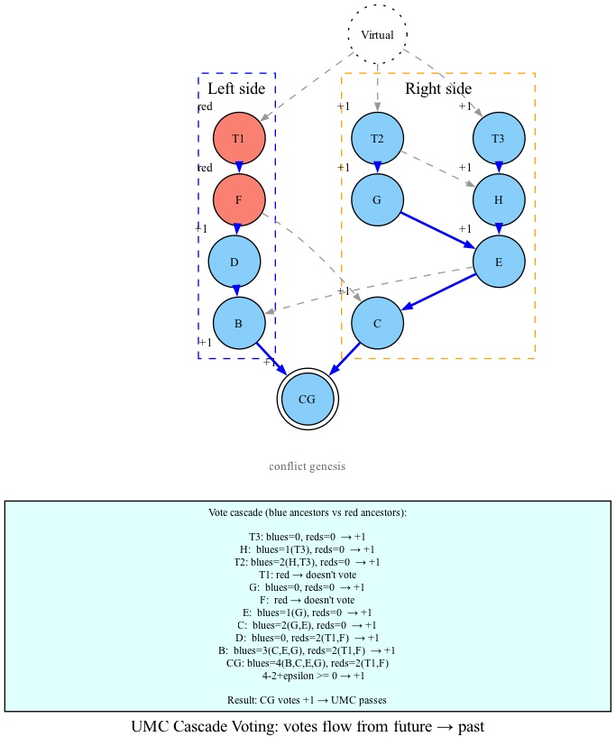
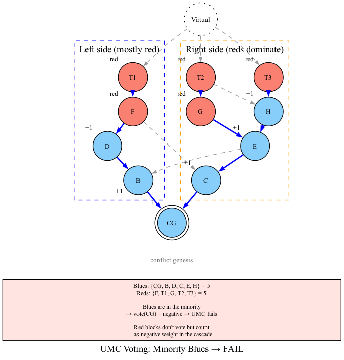

# 08 — UMC Voting

**CAVEAT**: Chapter is still under construction and unreviewed

## The Problem

K-Colouring gives us a k-cluster (the blue blocks). But having a large k-cluster is not enough — we need to verify that the cluster **uniformly covers** the DAG.

### Why Simple Majority Isn't Enough

Consider this scenario:

```
genesis → A → B → C → D → E → F → G → H

A cluster that covers 51% of the DAG but only in the distant past:
  Blue: {genesis, A}
  Red:  {B, C, D, E, F, G, H}

This cluster covers 51% of genesis's future (genesis + A = 2 out of 4),
but from H's perspective, the cluster covers 0% of its future.
```

A simple "51% of total blocks" check is vulnerable to attacks where the cluster covers the past but not the present. We need **Uniform Majority Coverage (UMC)**.

## d-UMC Definition

A set U (the blue cluster) is a **d-UMC** (d-deficit Uniform Majority Coverage) of G if:

1. `genesis(G) ∈ U`
2. For every block B in U:
   ```
   |future(B) ∩ U| + d ≥ |future(B) ∩ (G \ U)|
   ```

The parameter d (deficit) allows the cluster to be slightly short of majority at any point. In DAGKnight, `d = g(k) = floor(sqrt(k))`.

### Intuition

Every blue block must "see" at least as many blue blocks in its future as red blocks (within the zone), up to a deficit of d. This is a **local** majority check at every blue block, not just a global count.

If a blue block's future is dominated by reds, that blue block's condition fails, and the UMC check fails.

## The Cascade Voting Algorithm (Algorithm 6)

### The Naive Approach

A direct implementation of the d-UMC definition checks every blue block's future independently:

```python
def check_d_umc(blues, all_blocks, deficit):
    """Naive: check every blue block's future independently."""
    for blue in blues:
        blues_in_future = count(blue, blues, relation="future")
        reds_in_future = count(blue, all_blocks - blues, relation="future")
        if blues_in_future + deficit < reds_in_future:
            return False
    return True
```

This is O(n²) — for each of n blue blocks, we scan all blocks to count blues/reds in the future.

### The Cascade Voting Approach

UMC voting uses a **recursive cascade** from future to past, similar to SPECTRE's cascade voting. Instead of counting blocks, each block **votes**.

#### Algorithm (Paper Version)

```
Input:  G — the DAG (restricted to the conflict zone)
        U — the blue cluster (subset of G)
        e — deficit threshold (non-negative integer)

Output: vote — +1 if U is a e-UMC, -1 otherwise

function UMC-Voting(G, U, e):
    # Sum votes from all blue blocks in U's future
    v = 0
    for each block B in U ∩ G:
        v += UMC-Voting(future(B) ∩ G, U ∩ future(B) ∩ G, e)

    # Count red blocks (blocks in G but not in U)
    red_count = |G \ U|

    # Return sign of (vote_sum - red_count + deficit)
    if v - red_count + e >= 0:
        return 1    # POSITIVE — this block passes
    else:
        return -1   # NEGATIVE — this block fails
```

#### How It Works

1. **Blue blocks vote**: Each blue block contributes its own vote to blocks in its past.
2. **Red blocks don't vote**: Red blocks are simply counted (they contribute -1 to the score).
3. **Cascade**: Votes flow from future to past. A block's vote depends on votes from its future.
4. **Genesis decides**: If genesis's vote is positive, the cluster passes UMC.

#### Example



Blues: {genesis, B, C, E, G} | Reds: {D, F}

Vote computation flows from future to past:

| Block | Future blues vote sum | Red count | Result |
|-------|----------------------|-----------|--------|
| G | 0 | 0 | +1 |
| E | vote(G)=1 | 0 | +1 |
| F | red | — | doesn't vote |
| C | vote(E)=1 | 0 | +1 |
| D | red | — | doesn't vote |
| B | vote(C)+vote(E)+vote(G)=3 | 2 (D,F) | 3-2+e≥0 → +1 |
| genesis | vote(B)+vote(C)+vote(E)+vote(G)=4 | 2 (D,F) | 4-2+e≥0 → +1 |

Genesis's vote = +1, so UMC passes.

#### Counter-example: Minority Blues Fail



When blues are a minority, the cascade produces a negative vote at genesis and UMC fails.

#### Why Cascade Is Better Than Naive

The cascade approach has a key advantage: **memoization**. Once a block's vote is computed, it can be reused by all blocks in its past. This reduces redundant computation.

However, the paper's recursive algorithm as written still has worst-case O(n²) complexity, because in the worst case every block's vote must be computed and the recursion tree can be quadratic.

## Why The Paper's Approach Is Slow

### The O(n²) Problem

In the cascade voting algorithm:

1. For each blue block B, we need to compute its vote
2. Computing B's vote requires knowing the votes of all blue blocks in B's future
3. In the worst case (dense DAG), a block can have O(n) blue blocks in its future
4. Total work: O(n) blocks × O(n) futures = O(n²)

### The Rank Search Compounds the Problem

Rank calculation (Chapter 06) calls k-colouring for increasing values of k, and for each k, it calls UMC voting. If UMC voting is O(n²), the total rank search becomes O(n² × max_k), which is expensive.

### In Practice

For a conflict zone with thousands of blocks, O(n²) means millions of operations per rank check. With binary search over k values, this becomes computationally prohibitive.

## Why We Need Incremental UMC Voting

### The Incremental Opportunity

When computing rank, we call k-colouring with increasing k:

```
k = 0: k-colouring → UMC voting → FAIL
k = 1: k-colouring → UMC voting → FAIL
k = 2: k-colouring → UMC voting → FAIL
...
k = 5: k-colouring → UMC voting → PASS
```

Notice that as k increases:
- More blocks become blue (the cluster grows)
- Fewer blocks are red (they get recoloured blue)
- The zone structure remains the same

### The Insight: Floor Values

Instead of computing exact votes, we can compute a **floor** — a lower bound on each block's score:

```
For a blue block B:
  score(B) = (blue work in B's future) - (red work in B's future)
  floor(B) ≤ score(B)
```

If `floor(B) ≥ -deficit`, then `score(B) ≥ -deficit`, so B passes the UMC check without needing exact computation.

### The Heap-Based Approach

1. Compute floor values for all blue blocks incrementally
2. Maintain a min-heap of floor values
3. Check: if minimum floor ≥ -deficit, all blocks pass
4. Only compute exact votes for blocks with floor < -deficit

### Why Incremental Works

When a new block is coloured:

| Event | Effect | Cost |
|-------|--------|------|
| Block coloured **blue** | Compute its floor from local data, insert into heap | O(log n) |
| Block coloured **red** | Update floors of blue blocks in its anticone | O(K × log n) |

The floor computation uses **local** data (mergeset, inherited counters) rather than global scans.

### The Floor Formula

```
For blue block B:
  floor(B) = (blue_work_in_zone - effective_past_blue_work(B))
            - (red_work_in_zone - past_red_work(B) - L(B))
            - anticone_blue_work(B)

Where:
  effective_past_blue_work(B) = past_blue_work(B) + work(B)
  L(B) = lower bound on anticone red work (incrementally updated)
  anticone_blue_work(B) = blue work in B's anticone within the zone
```

If `floor(B) ≥ -deficit`, then `score(B) ≥ -deficit` and B passes.

## Summary

| Aspect | Paper's UMC Voting | Incremental UMC Voting |
|--------|-------------------|----------------------|
| **Algorithm** | Recursive cascade from Algorithm 6 | Floor-based heap with incremental updates |
| **Complexity** | O(n²) worst case | O(n × K) amortized |
| **When needed** | Always | Only for blocks with floor < -deficit |
| **Key structure** | Recursion stack | Min-heap of floor values |
| **Persistence** | Not possible | Can persist heap between calls |

UMC voting is the gatekeeper that determines whether a k-cluster is sufficient. The paper's recursive cascade is conceptually clean but computationally expensive. The incremental approach (discussed in detail in future revisions) transforms UMC voting from a bottleneck into an efficient, cacheable operation.

## What's Next

This chapter explained UMC voting as described in the paper. In our next revision, we'll dive deeper into:
1. **The exact floor computation** — how each counter is derived incrementally
2. **The heap data structure** — how it enables O(log n) checks
3. **Persistence** — how to cache UMC voting state between rank checks
4. **The peel-and-recover mechanism** — how to handle zone changes incrementally
